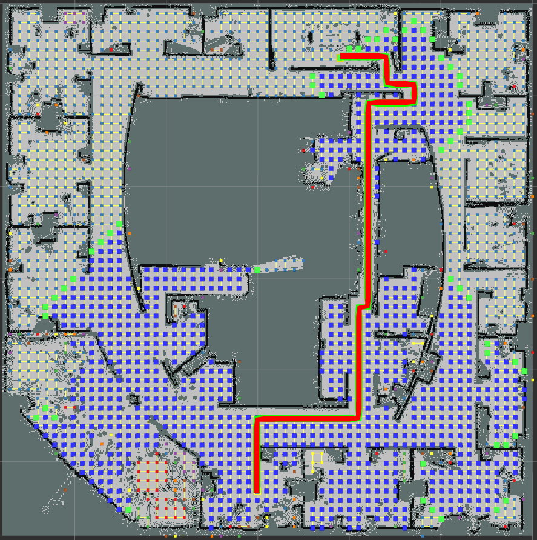

# Path Planner ROS Package

The Path Planner ROS package provides algorithms for optimal path finding (A* and Dijkstra) on grid maps and Probabilistic Roadmap (PRM) models. It features gradient descent smoothing for paths and tools for analyzing graph connectivity.

## Installation

Clone the repository into your catkin workspace:

```bash
cd ~/catkin_ws/src
git clone <your-repository-url>
cd ..
catkin_make
```

## Usage

Run the path planner using:

```bash
roslaunch path_planner path_planner.launch
```

## Features
- **Path Finding**: Implements A* and Dijkstra's algorithms to find the most efficient path between nodes.
- **Path Smoothing**: Uses a gradient descent method to smooth paths, reducing sharp turns and unnecessary maneuvers.
- **Connectivity Analysis**: Analyzes and visualizes the connectivity of PRM graphs to ensure comprehensive path coverage.

## Configuration

Modify parameters in the ROS launch file to tailor the planner's behavior:

- `heuristic_weight`: Adjusts the weight of the heuristic in the A* algorithm.
- `prm_num_nodes`: Sets the number of nodes in the Probabilistic Roadmap (PRM).
- `alpha` and `beta`: Control the smoothing process, balancing between path fidelity and smoothness.

## Comparative Analysis

### A* vs. Dijkstra

By setting `heuristic_weight` to zero, A* behaves similarly to Dijkstra’s algorithm. A* typically visits fewer nodes than Dijkstra's, demonstrating its efficiency by using a heuristic to prioritize nodes that are believed to be closer to the goal.

#### Visualization of Algorithms
Dijkstra’s algorithm explores a larger number of nodes (depicted in blue) compared to A*.
**Dijkstra’s Algorithm**


**A* Algorithm**


## Parameter Impact

- **Node Density**: Increasing `prm_num_nodes` enhances connectivity. This is crucial in complex environments where a higher node density may facilitate finding viable paths.

#### Visualizations of Node Density Impact

** Comparison of Connectivity with Varying Node Counts**

- **200 Nodes:** Shows limited connectivity.
  
  

- **500 Nodes:** Significantly improved connectivity.
  
  

### Case Study: Maze Map

Node density is crucial for pathfinding in complex terrains like mazes.

**Pathfinding Success in a Maze**

- **500 Nodes:** Insufficient for a viable path.
  
  

- **800 Nodes:** Enhanced node density leading to successful pathfinding.
  
  


- **Smoothing Parameters (`alpha` & `beta`)**: 
- **`alpha`**: Higher values keep the path close to the initial, rough path.
- **`beta`**: Higher values result in a smoother, less angular path.

#### Visualizations of Smoothing Effects

**Impact of Smoothing Parameters**

- **High Alpha (0.9, Beta 0.1)**: Maintains path fidelity.

  

- **High Beta (0.1, Alpha 0.9)**: Creates a smoother path.

  

## Video Demonstration

Watch the [video demonstration](https://www.youtube.com/watch?v=uqt3r7womo0) to see the path planner in action across various tasks and maps. Highlights include connectivity analysis, dynamic adjustments to PRM node counts, and testing the A* algorithm with smoothing on different map types.

[](https://www.youtube.com/watch?v=uqt3r7womo0 "Click to Watch!")
